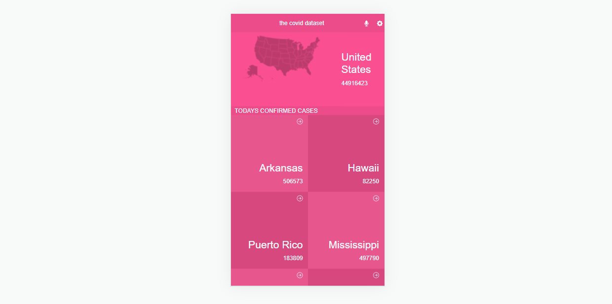
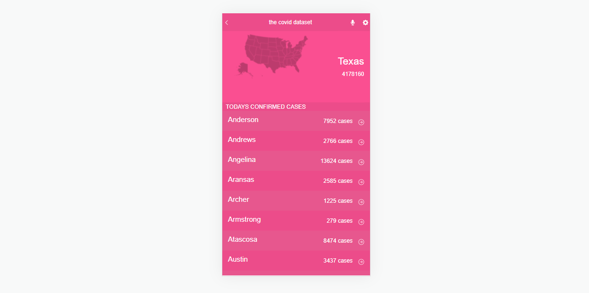

# the-covid-datacenter

# The Covid Data Center

This was our React capstone project for Microverse curiculum. It is mobile web application to check a list of metrics (numeric values) for the Covid-19 that I created making use of React and Redux and the Coronavirus data API from Narrativa.com.

## Built With

- React js
- Redux
- React Bootstrap 
- Bootstrap
- Javascript
- CSS
- JSX

## Live Demo
[Live Demo](https://youthful-lichterman-4505b6.netlify.app/)

## Getting Started

- Clone the repository with `git clone` https://github.com/DyaryRaoof/the-covid-datacenter.git;
- Open the cloned folder on the IDE of your choice;
- Install dependencies with `npm i`;
- Use `npm start` to start the website;
- Use `npm test` to run tests;
- 
## Authors

👤 **Dyary Raoof Bayz**

- GitHub: [@DyaryRaoof](https://github.com/DyaryRaoof)
- Twitter: [@DyaryRaoof](https://twitter.com/DyaryRaoof)
- LinkedIn: [@DyaryRaoof](https://linkedin.com/in/DyaryRaoof)

## 🤝 Contributing

Contributions, issues, and feature requests are welcome!

Feel free to check the [issues page](../../issues/).

## Show your support

Give a ⭐️ if you like this project!

## Acknowledgments

- Hat tip to anyone whose code was used
- [Narrative API](https://covid19tracking.narrativa.com/index_en.html)
- Microverse
- Original design idea by [Nelson Sakwa](https://www.behance.net/sakwadesignstudio) on Behance

## 📝 License

This project is [MIT](./MIT.md) licensed.
